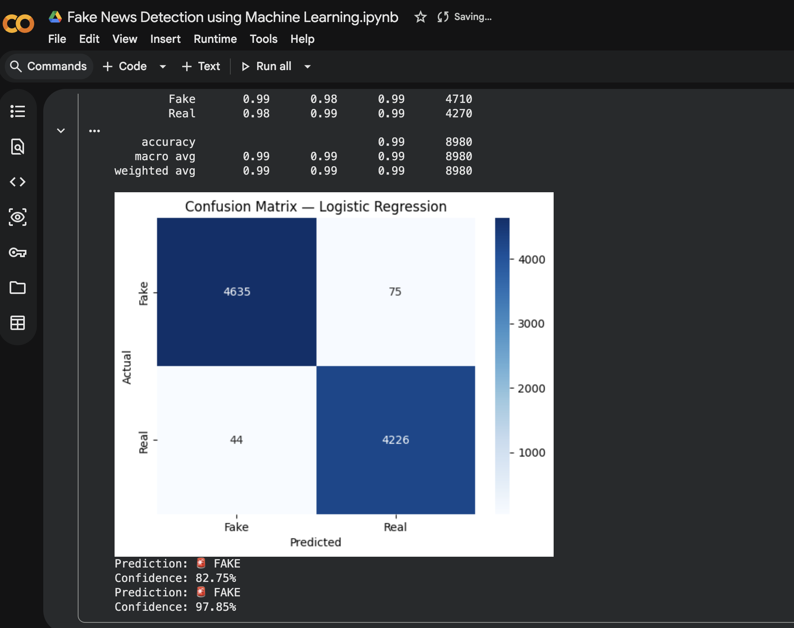

#  Fake News Detection using Machine Learning

Detect whether a news article is REAL or FAKE using NLP and Machine Learning.

## 📊 Results
- ✅ Accuracy: **99%**
- ✅ Precision: 0.99 | Recall: 0.99 | F1-Score: 0.99
- ✅ Tested on 44,000+ real-world news articles

##  Tech Stack
- Python
- Scikit-learn
- TF-IDF Vectorization
- Naive Bayes & Logistic Regression
- Pandas, NumPy, Matplotlib, Seaborn

##  Dataset
(https://www.kaggle.com/datasets/clmentbisaillon/fake-and-real-news-dataset) — 44,000+ articles

##  How It Works
1. Load & merge Fake and Real news datasets
2. Clean and preprocess text (remove URLs, punctuation, etc.)
3. Convert text to numbers using TF-IDF
4. Train Naive Bayes and Logistic Regression models
5. Evaluate using Confusion Matrix and Classification Report
6. Predict on new articles in real time

##  Results

##  How to Run
1. Open the notebook in Google Colab (https://colab.research.google.com)
2. Download the dataset from Kaggle
3. Run all cells top to bottom
